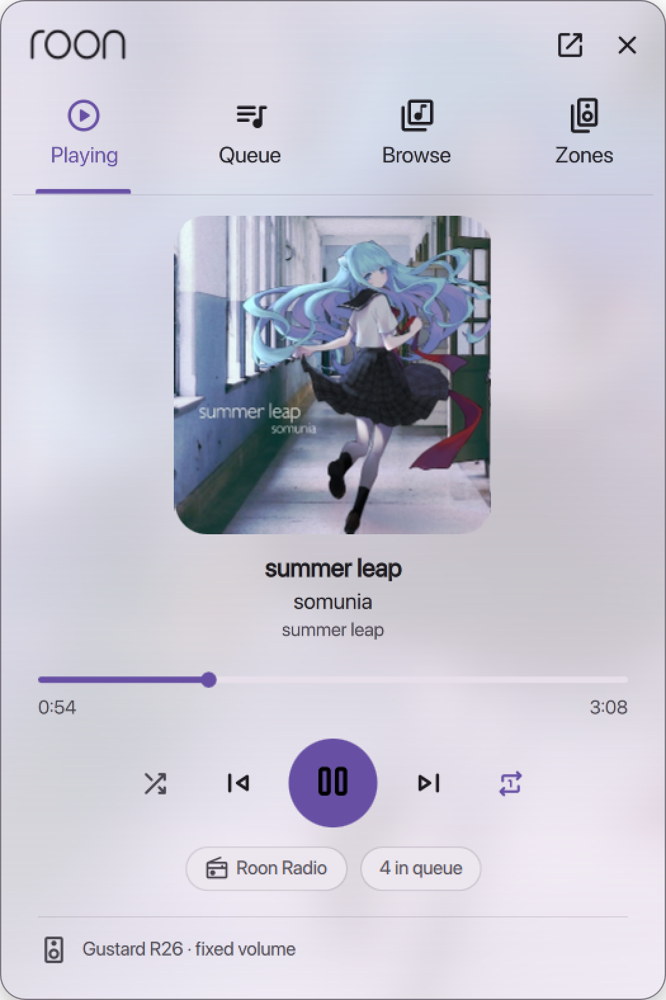
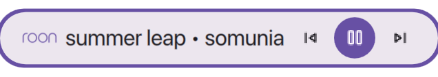
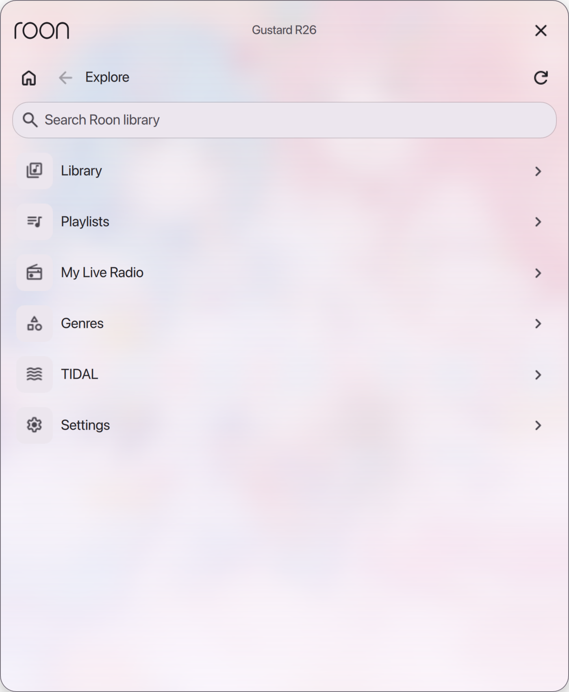
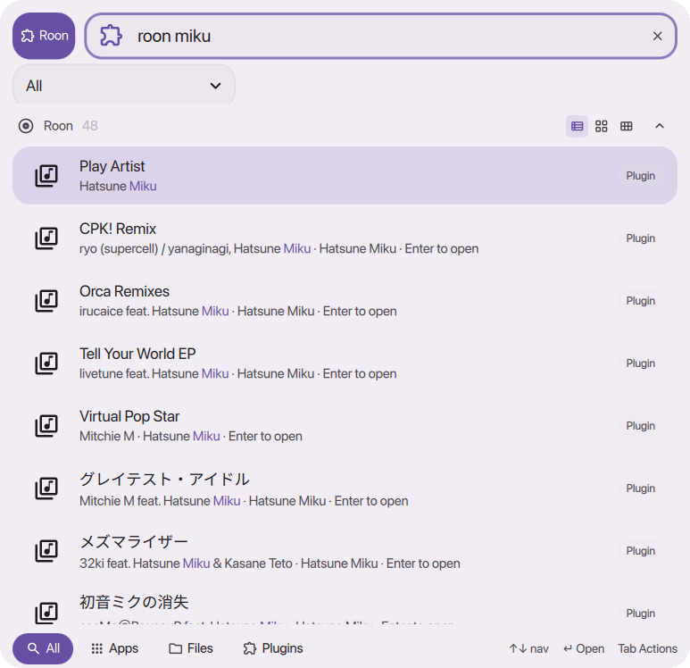

# Roon for DankMaterialShell

A [DankMaterialShell](https://danklinux.com) plugin that puts [Roon](https://roon.app) on your desktop.

<p align="center"></p>

| Bar pill | Library browser | Launcher search |
| --- | --- | --- |
|  |  |  |

- **Bar widget** — now-playing pill (Roon mark, title, artist, transport buttons, scroll for volume) with a popout: album art over a blurred backdrop, seek bar, shuffle/repeat/Roon Radio, per-output volume, play queue, library browser and zone picker.
- **Control Center tile** — play/pause toggle with compact controls.
- **Launcher** — type `roon <query>` in DankLauncher to search your library. Tracks play; albums, artists and playlists open in a centered library browser. Tab offers Play Now / Queue / Add Next / Start Radio. `roon` alone lists transport shortcuts, the library browser and your zones.
- **Desktop widget** — resizable now-playing card on the desktop layer.
- **MPRIS bridge** — the selected zone shows up as an MPRIS player, so media keys, `playerctl` and DMS's own media widget work.
- **Open in Roon** — focuses your Roon window (or launches the app) for anything deeper.
- **IPC** — `dms ipc call roon playpause|next|previous|volume up|zone "Living Room"|browse|popout zones|open|status` for compositor keybinds.

## How it works

Roon's API is WebSocket based and only ships as Node.js packages, so the plugin runs a small
Node sidecar (`dist/roon-bridge.cjs`, bundled from `bridge/`) that discovers and pairs with Roon
Server, and talks to the QML side over stdio as JSON lines. Album art is loaded straight from
Roon Server's HTTP image endpoint.

## Requirements

- DankMaterialShell ≥ 1.5
- Node.js ≥ 20 on `PATH`
- Roon Server reachable on the LAN (auto-discovery) or via a manual host:port

## Install

```sh
git clone https://github.com/NoaHimesaka1873/dms-plugin-roon ~/.config/DankMaterialShell/plugins/Roon
```

1. DMS Settings → Plugins → enable **Roon**.
2. Add the **Roon** widget to a DankBar section (and/or place the desktop widget).
3. In Roon: Settings → Extensions → **Enable** next to *DMS Roon*.

## Settings

DMS Settings → Plugins → Roon:

- **Connection**: auto-discovery or a manual host:port, preferred zone, MPRIS toggle, restart / re-pair.
- **Bar widget**: size (Small / Medium / Large / Largest, the same scale as the built-in media widget), text format, bar icon (none / note / Roon logo / album art), show-when-idle, scroll volume step. Add **sized variants** to get extra "Roon: <name>" widgets in the DankBar widget list, each with its own size, so different bars can use different pills. The bar entry's `mediaSize` is honoured too.
- **Desktop widget**: background opacity, art-only tile.
- **Roon app**: the plugin detects Bottles (Flatpak or native) and a bottle named `Roon`. *Open in Roon* buttons only appear when the app is found; with Bottles but no Roon, a **Set up Roon in Bottles** button creates the bottle and opens Bottles, where *Install Programs → Roon* applies the [official Roon installer manifest](https://github.com/bottlesdevs/programs/blob/main/Software/roon.yml) (.NET Desktop 10, the Roon installer, and the program entry). A custom launch command can override this.

## Development

```sh
cd bridge
npm install --allow-git=all   # the Roon API packages are git dependencies
npm run build                 # → ../dist/roon-bridge.cjs
node ../dist/roon-bridge.cjs --state-dir /tmp/roon-dev --linger 30   # standalone test
dms ipc call plugins reload roon   # after editing surface QML (bar widget, daemon, launcher, desktop)
dms restart                        # after editing services/, components/, assets/ or RoonSettings.qml
```

## Credits

The Roon logo artwork comes from [Simple Icons](https://simpleicons.org) (CC0). Roon is a trademark of Roon Labs.

## License

MIT
